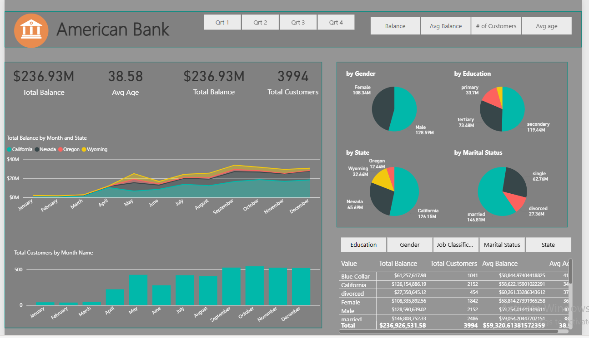
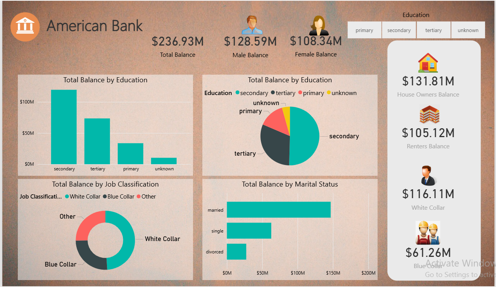
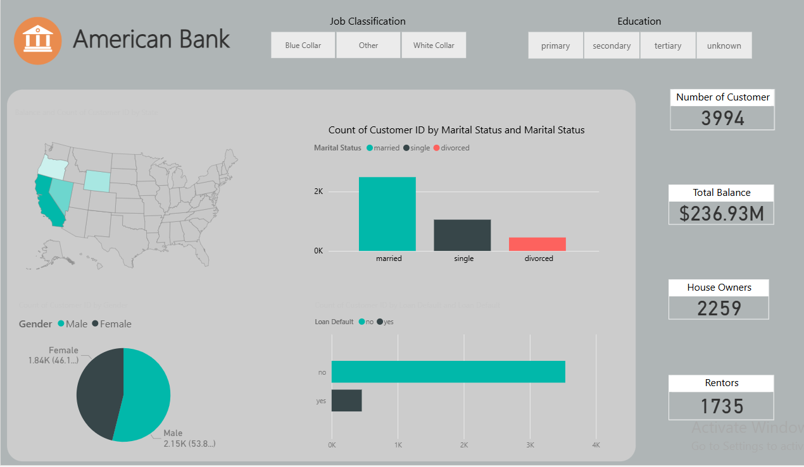
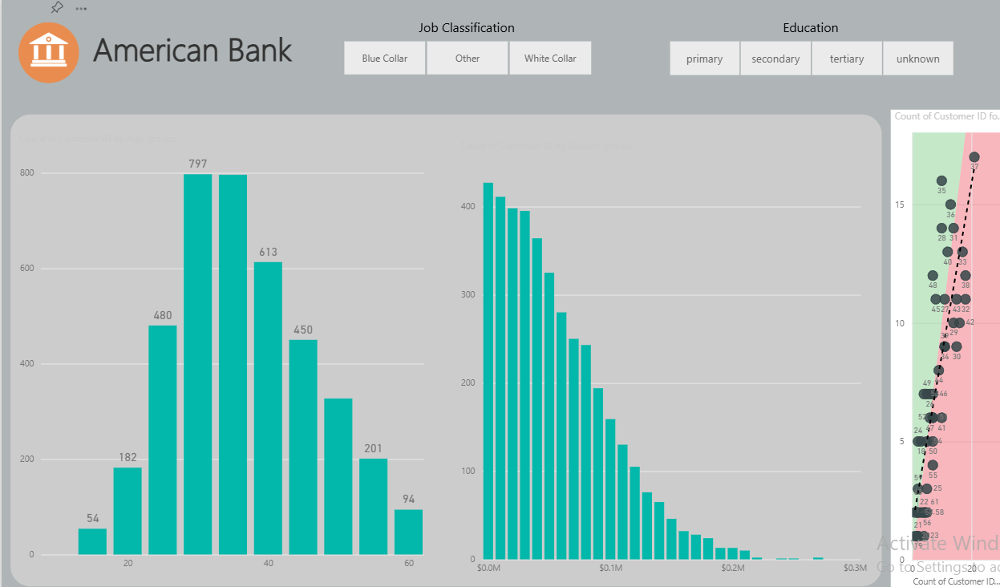

# Banking Loan and Risk Portfolio Analysis

**Project Type:** Power BI Project  
**Platform:** Power BI Desktop  

## Overview
This project focuses on analyzing a **bank’s loan portfolio** to identify risk patterns, track loan performance, and monitor default trends.

## Key Insights
- **Higher default rates** among customers with low credit scores and short employment history.  
- Majority of loans were concentrated in **personal loans and small business loans**.  
- **Risk heatmaps** highlighted key customer segments with higher probability of default.  

## Dashboard Screenshots
  
  
  
  

## Power BI File
[Download PBIX File](https://app.powerbi.com/links/r4b9bImEnG?ctid=12802ece-a88b-4f6d-8b24-1d0bb7c8f43e&pbi_source=linkShare)
