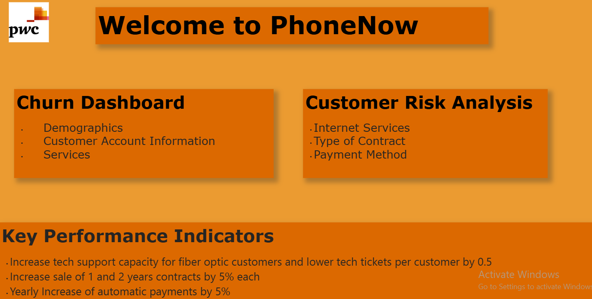
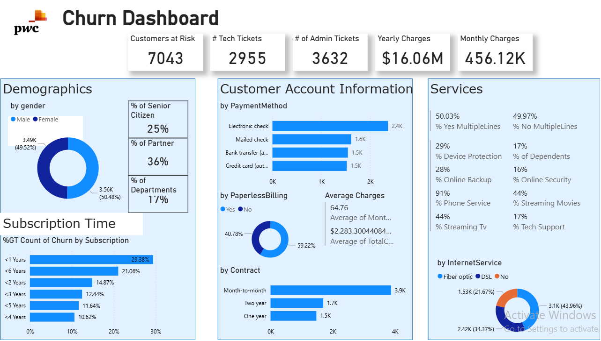
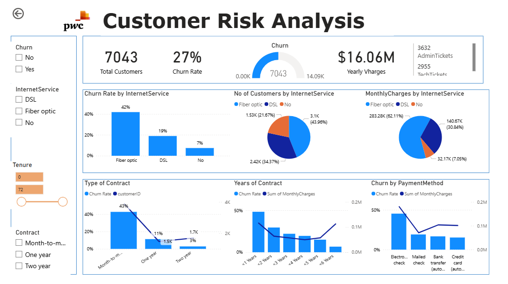

# PwC Churn Analysis

**Project Type:** Virtual Internship Project  
**Platform:** Power BI  

## Overview
This project is part of the PwC Virtual Internship. I built an interactive **churn dashboard** to identify at-risk customers and suggest retention strategies.

## Key Insights
- Month-to-month contracts and fiber optic customers had the **highest churn rates**.  
- Customers using **auto-payment methods showed higher retention**.  
- Churn is strongly linked to **contract type, payment method, and service type**.  

## Dashboard Screenshots
  
  

## Power BI File
[Download PBIX File](https://app.powerbi.com/links/W9aRBS7-cZ?ctid=12802ece-a88b-4f6d-8b24-1d0bb7c8f43e&pbi_source=linkShare)
